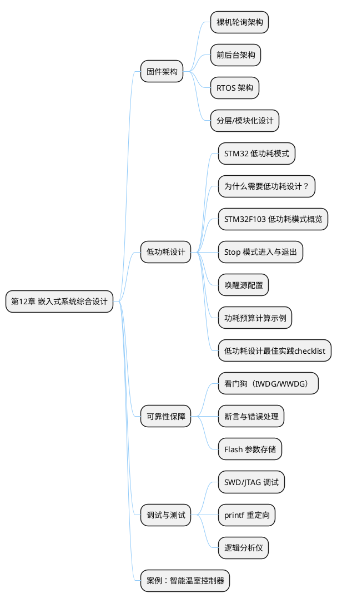
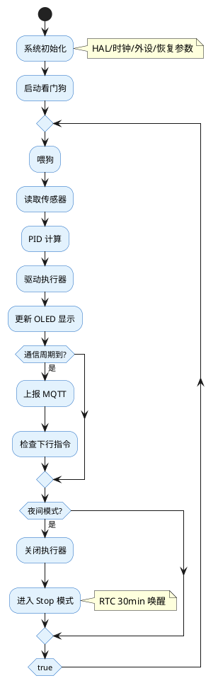

## 12 第 12 章 嵌入式系统综合设计

> 前面各章分别介绍了外设驱动、传感器、执行器、通信和控制。本章将从系统层面讨论嵌入式产品的设计方法论，包括低功耗设计、固件架构、可靠性保障和调试技术，帮助学生从"写一个外设驱动"提升到"设计一个完整的嵌入式产品"。

### 12.1 本章知识导图



**图 12-1** 本章知识导图：嵌入式系统综合设计的关键要素。
<!-- fig:ch12-1 本章知识导图：嵌入式系统综合设计的关键要素。 -->

### 12.2 固件架构设计

#### 12.2.1 三种典型架构

**表 12-1** 三种固件架构对比
<!-- tab:ch12-1 三种固件架构对比 -->

| 架构 | 结构 | 优点 | 缺点 | 适用场景 |
|------|------|------|------|---------|
| 裸机轮询 | `while(1)` 顺序执行 | 简单直观 | 无法响应实时事件 | LED 闪烁等极简应用 |
| 前后台 | 中断（前台）+ `while(1)`（后台） | 实时性好 | 中断中不宜执行耗时操作 | 大多数中小型项目 |
| RTOS | 多任务调度 | 模块化、可扩展 | 占用 RAM、学习成本高 | 复杂多任务系统 |

#### 12.2.2 前后台架构实践

前后台架构是嵌入式开发最常用的模式——中断中置标志位/存数据，主循环中处理逻辑：

```c
/* 全局标志 */
volatile uint8_t flag_uart_rx = 0;
volatile uint8_t flag_tim_10ms = 0;
volatile uint8_t flag_adc_done = 0;

/* 中断：置标志 + 快速存数据 */
void HAL_TIM_PeriodElapsedCallback(TIM_HandleTypeDef *htim)
{
    if (htim->Instance == TIM6)
        flag_tim_10ms = 1;
}

/* 主循环：依次处理各事件 */
int main(void)
{
    HAL_Init();
    SystemClock_Config();
    Periph_Init();

    while (1) {
        if (flag_tim_10ms) {
            flag_tim_10ms = 0;
            PID_Control_Task();    /* 10ms 周期控制 */
        }
        if (flag_uart_rx) {
            flag_uart_rx = 0;
            Command_Parse_Task();  /* 解析串口指令 */
        }
        if (flag_adc_done) {
            flag_adc_done = 0;
            Sensor_Process_Task(); /* 传感器数据处理 */
        }
        Display_Update_Task();     /* 低优先级刷新显示 */
    }
}
```

#### 12.2.3 分层模块化设计

```bob
  ┌─────────────────────────────────────────────┐
  │               应用层 (Application)           │
  │  main.c, task_xxx.c                         │
  ├─────────────────────────────────────────────┤
  │               服务层 (Service)               │
  │  pid.c, protocol.c, mqtt.c                  │
  ├─────────────────────────────────────────────┤
  │               驱动层 (Driver)                │
  │  motor.c, dht11.c, oled.c, esp8266.c       │
  ├─────────────────────────────────────────────┤
  │               硬件抽象层 (HAL)               │
  │  stm32f1xx_hal_xxx.c                        │
  ├─────────────────────────────────────────────┤
  │               硬件 (Hardware)                │
  │  STM32F103C8T6 + 外围电路                    │
  └─────────────────────────────────────────────┘
```

**图 12-2** 分层固件架构：上层调用下层接口，禁止跨层或反向调用。
<!-- fig:ch12-2 分层固件架构：上层调用下层接口，禁止跨层或反向调用。 -->

---

### 12.3 低功耗设计

#### 12.3.1 为什么需要低功耗设计？

##### 场景：电池供电的农业传感器节点

在智慧农业应用中，大量传感器节点部署在田间地头，采集土壤温湿度、光照强度、PH 值等数据。这些节点通常具有以下约束：

| 约束项 | 典型值 | 影响 |
|--------|--------|------|
| 供电方式 | 太阳能+锂电池 / 一次性锂亚电池 | 无法频繁更换电池 |
| 部署密度 | 每亩 10~50 个节点 | 维护成本极高 |
| 数据上报周期 | 5 分钟 ~ 1 小时 | 99% 时间处于空闲 |
| 工作环境 | -20°C ~ 60°C | 电池容量随温度衰减 |

**核心矛盾**：节点 99% 的时间处于空闲等待状态，但传统运行模式（Run Mode）下 MCU 持续消耗数 mA 甚至数十 mA 电流，导致电池数月内耗尽。

**解决思路**：利用 STM32F103 的低功耗模式，在空闲时进入 **Stop 模式**（电流降至 ~10 µA 量级），仅保留必要外设和唤醒源，从而将续航时间从"月"延长至"年"。

---

#### 12.3.2 STM32F103 低功耗模式概览

STM32F103 支持三种主要低功耗模式：

| 模式 | 进入条件 | 唤醒源 | 典型电流 | 寄存器/内存状态 |
|------|----------|--------|----------|-----------------|
| **Sleep** | `WFI()` / `WFE()` | 任意中断/事件 | ~1 mA | 全保留，CPU 停止 |
| **Stop** | `HAL_PWR_EnterSTOPMode()` | 外部中断、RTC 闹钟、IWDG | ~10 µA | 寄存器/内存保留，时钟停止 |
| **Standby** | `HAL_PWR_EnterSTANDBYMode()` | WKUP 引脚、RTC 闹钟、IWDG、NRST | ~2 µA | 寄存器/内存丢失，仅备份域保留 |

> **农业传感器推荐**：使用 **Stop 模式**。Standby 模式虽然电流更低，但唤醒后系统复位，上下文丢失，不利于周期性采集任务；Sleep 模式功耗仍偏高。

---

#### 12.3.3 Stop 模式进入与退出

##### 3.1 进入 Stop 模式的核心代码

```c
#include "stm32f1xx_hal.h"

/**
 * @brief  进入 Stop 模式，使用电压调节器低功耗模式
 * @param  None
 * @retval None
 * @note   唤醒后需重新配置系统时钟为 72MHz
 */
void Enter_Stop_Mode(void)
{
    /* 1. 确保所有未使用的外设已关闭以降低漏电流 */
    __HAL_RCC_GPIOA_CLK_DISABLE();  // 根据实际接线保留需唤醒的 GPIO 时钟
    __HAL_RCC_GPIOB_CLK_DISABLE();
    __HAL_RCC_GPIOC_CLK_DISABLE();
    __HAL_RCC_ADC1_CLK_DISABLE();
    __HAL_RCC_TIM2_CLK_DISABLE();
    __HAL_RCC_USART1_CLK_DISABLE();
    /* ... 保留 RTC 和唤醒源相关外设时钟 ... */

    /* 2. 配置电压调节器为低功耗模式（可选，进一步降低功耗） */
    /* 若要求更快唤醒，可改用 PWR_MAINREGULATOR_ON */

    /* 3. 进入 Stop 模式：使用 WFI 指令，电压调节器低功耗模式 */
    HAL_PWR_EnterSTOPMode(PWR_LOWPOWERREGULATOR_ON, PWR_STOPENTRY_WFI);

    /* 
     * 4. 唤醒后的恢复代码（从 WFI 返回后继续执行此处）
     *    注意：Stop 模式唤醒后，系统时钟自动切换为 HSI 8MHz
     *    必须手动恢复为 HSE + PLL 的 72MHz 配置
     */
    SystemClock_Config_Restore();
}

/**
 * @brief  恢复系统时钟到 72MHz (HSE + PLL)
 * @note   此函数内容通常与 CubeMX 生成的 SystemClock_Config() 相同
 */
void SystemClock_Config_Restore(void)
{
    RCC_OscInitTypeDef RCC_OscInitStruct = {0};
    RCC_ClkInitTypeDef RCC_ClkInitStruct = {0};

    /* 使能 HSE */
    RCC_OscInitStruct.OscillatorType = RCC_OSCILLATORTYPE_HSE;
    RCC_OscInitStruct.HSEState = RCC_HSE_ON;
    RCC_OscInitStruct.HSEPredivValue = RCC_HSE_PREDIV_DIV1;
    RCC_OscInitStruct.PLL.PLLState = RCC_PLL_ON;
    RCC_OscInitStruct.PLL.PLLSource = RCC_PLLSOURCE_HSE;
    RCC_OscInitStruct.PLL.PLLMUL = RCC_PLL_MUL9;  // 8MHz * 9 = 72MHz
    if (HAL_RCC_OscConfig(&RCC_OscInitStruct) != HAL_OK)
    {
        Error_Handler();
    }

    /* 配置总线分频 */
    RCC_ClkInitStruct.ClockType = RCC_CLOCKTYPE_HCLK|RCC_CLOCKTYPE_SYSCLK
                                |RCC_CLOCKTYPE_PCLK1|RCC_CLOCKTYPE_PCLK2;
    RCC_ClkInitStruct.SYSCLKSource = RCC_SYSCLKSOURCE_PLLCLK;
    RCC_ClkInitStruct.AHBCLKDivider = RCC_SYSCLK_DIV1;
    RCC_ClkInitStruct.APB1CLKDivider = RCC_HCLK_DIV2;
    RCC_ClkInitStruct.APB2CLKDivider = RCC_HCLK_DIV1;
    if (HAL_RCC_ClockConfig(&RCC_ClkInitStruct, FLASH_LATENCY_2) != HAL_OK)
    {
        Error_Handler();
    }
}
```

##### 3.2 关键 API 详解

```c
void HAL_PWR_EnterSTOPMode(uint32_t Regulator, uint8_t STOPEntry);
```

| 参数 | 可选值 | 说明 |
|------|--------|------|
| `Regulator` | `PWR_MAINREGULATOR_ON` | 主电压调节器保持开启，唤醒更快，功耗略高 |
| | `PWR_LOWPOWERREGULATOR_ON` | 主调节器进入低功耗模式，功耗更低，唤醒延迟稍大 |
| `STOPEntry` | `PWR_STOPENTRY_WFI` | 使用 Wait-For-Interrupt 进入，任意中断唤醒 |
| | `PWR_STOPENTRY_WFE` | 使用 Wait-For-Event 进入，事件唤醒 |

> **农业传感器推荐**：使用 `PWR_LOWPOWERREGULATOR_ON + PWR_STOPENTRY_WFI`，兼顾超低功耗与中断响应。

---

#### 12.3.4 唤醒源配置

##### 4.1 RTC 闹钟唤醒（周期性采集场景）

适用于"每 10 分钟采集一次数据"的定时唤醒需求。

```c
#include "stm32f1xx_hal.h"

RTC_HandleTypeDef hrtc;

/**
 * @brief  RTC 初始化（使用外部 32.768kHz 晶振 LSE）
 */
void RTC_Init_With_WakeUp(void)
{
    /* 使能 PWR 和 BKP 时钟，访问备份域 */
    __HAL_RCC_PWR_CLK_ENABLE();
    __HAL_RCC_BKP_CLK_ENABLE();
    HAL_PWR_EnableBkUpAccess();

    /* RTC 初始化结构体 */
    hrtc.Instance = RTC;
    hrtc.Init.AsynchPrediv = RTC_AUTO_1_SECOND;  // 默认 1 秒分频
    if (HAL_RTC_Init(&hrtc) != HAL_OK)
    {
        Error_Handler();
    }

    /* 配置 RTC 闹钟：10 分钟后唤醒 */
    RTC_AlarmTypeDef sAlarm = {0};
    RTC_TimeTypeDef sTime = {0};

    /* 获取当前时间 */
    HAL_RTC_GetTime(&hrtc, &sTime, RTC_FORMAT_BIN);

    /* 设置闹钟时间：当前秒数 + 600 秒（10 分钟），需处理进位 */
    uint32_t alarm_seconds = (sTime.Seconds + 600) % 60;
    uint32_t alarm_minutes = (sTime.Minutes + (sTime.Seconds + 600) / 60) % 60;
    uint32_t alarm_hours   = (sTime.Hours + (sTime.Minutes + (sTime.Seconds + 600) / 60) / 60) % 24;

    sAlarm.AlarmTime.Hours = alarm_hours;
    sAlarm.AlarmTime.Minutes = alarm_minutes;
    sAlarm.AlarmTime.Seconds = alarm_seconds;

    if (HAL_RTC_SetAlarm_IT(&hrtc, &sAlarm, RTC_FORMAT_BIN) != HAL_OK)
    {
        Error_Handler();
    }

    /* 使能 RTC 闹钟中断（连接至 EXTI Line 17） */
    HAL_NVIC_SetPriority(RTC_Alarm_IRQn, 0, 0);
    HAL_NVIC_EnableIRQ(RTC_Alarm_IRQn);
}

/**
 * @brief  RTC 闹钟中断服务函数
 */
void RTC_Alarm_IRQHandler(void)
{
    HAL_RTC_AlarmIRQHandler(&hrtc);
}

/**
 * @brief  闹钟回调（HAL 库弱定义回调）
 */
void HAL_RTC_AlarmAEventCallback(RTC_HandleTypeDef *hrtc)
{
    /* 设置全局标志，主循环检测到后执行采集与发送 */
    g_wakeup_flag = WAKEUP_BY_RTC;

    /* 清除闹钟标志，准备下一次设置 */
    __HAL_RTC_ALARM_CLEAR_FLAG(hrtc, RTC_FLAG_ALRF);
}
```

> **注意**：STM32F103 的 RTC 闹钟固定映射到 **EXTI Line 17**，无需手动配置 EXTI，但需确保 NVIC 中断使能。

##### 4.2 外部中断唤醒（突发事件场景）

适用于"土壤湿度突变需立即上报"或"人工按键触发"场景。

```c
/**
 * @brief  配置 PA0 为外部中断唤醒源（下降沿触发，连接土壤湿度报警传感器）
 */
void EXTI0_WakeUp_Init(void)
{
    GPIO_InitTypeDef GPIO_InitStruct = {0};

    /* 使能 GPIOA 时钟（Stop 模式下需根据手册确认是否可关闭） */
    __HAL_RCC_GPIOA_CLK_ENABLE();

    /* 配置 PA0 为输入上拉 */
    GPIO_InitStruct.Pin = GPIO_PIN_0;
    GPIO_InitStruct.Mode = GPIO_MODE_IT_FALLING;  // 下降沿触发
    GPIO_InitStruct.Pull = GPIO_PULLUP;
    HAL_GPIO_Init(GPIOA, &GPIO_InitStruct);

    /* 配置 EXTI0 中断 */
    HAL_NVIC_SetPriority(EXTI0_IRQn, 0, 0);
    HAL_NVIC_EnableIRQ(EXTI0_IRQn);
}

/**
 * @brief  EXTI0 中断服务函数
 */
void EXTI0_IRQHandler(void)
{
    HAL_GPIO_EXTI_IRQHandler(GPIO_PIN_0);
}

/**
 * @brief  EXTI 回调函数
 */
void HAL_GPIO_EXTI_Callback(uint16_t GPIO_Pin)
{
    if (GPIO_Pin == GPIO_PIN_0)
    {
        g_wakeup_flag = WAKEUP_BY_EXTI;
    }
}
```

##### 4.3 主循环中的低功耗调度逻辑

```c
typedef enum {
    WAKEUP_NONE = 0,
    WAKEUP_BY_RTC,
    WAKEUP_BY_EXTI
} WakeUp_Source_t;

volatile WakeUp_Source_t g_wakeup_flag = WAKEUP_NONE;

int main(void)
{
    HAL_Init();
    SystemClock_Config();  /* 初始 72MHz */

    /* 初始化外设 */
    RTC_Init_With_WakeUp();
    EXTI0_WakeUp_Init();
    Sensor_Init();
    LoRa_Init();  /* 或其他无线模块 */

    while (1)
    {
        if (g_wakeup_flag == WAKEUP_BY_RTC)
        {
            g_wakeup_flag = WAKEUP_NONE;

            /* 采集数据 */
            Sensor_Data_t data = Sensor_Read();

            /* 快速发送 */
            LoRa_Send(&data);

            /* 重新设置下一次 RTC 闹钟 */
            RTC_Set_Next_Alarm(600);  /* 10 分钟后 */
        }
        else if (g_wakeup_flag == WAKEUP_BY_EXTI)
        {
            g_wakeup_flag = WAKEUP_NONE;

            /* 紧急事件处理 */
            Sensor_Data_t data = Sensor_Read();
            data.is_urgent = 1;
            LoRa_Send(&data);

            /* 保持原有 RTC 闹钟计划，无需重置 */
        }

        /* 任务完成后进入 Stop 模式 */
        Enter_Stop_Mode();

        /* 唤醒后从这里继续执行，根据 g_wakeup_flag 判断唤醒源 */
    }
}
```


#### 12.3.5 功耗预算计算示例

##### 5.1 系统功耗模型

农业传感器节点的总功耗由三部分组成：

`E_total = E_active + E_sleep + E_peripheral_leakage`

##### 5.2 典型参数假设

| 参数 | 数值 | 说明 |
|------|------|------|
| 供电电压 | 3.3 V | 锂电池经 LDO 稳压 |
| 电池容量 | 2000 mAh | 18650 锂电池 |
| 系统时钟（工作） | 72 MHz | HSE + PLL |
| 采集+发送周期 | 每 10 分钟一次 | RTC 定时唤醒 |
| 单次工作时间 | 2 秒 | 传感器预热 + ADC + 无线发送 |
| 工作电流 | 30 mA | MCU + 传感器 + LoRa 模块 |
| Stop 模式电流 | 12 µA | MCU + RTC + LSE |
| 静态漏电流 | 5 µA | 电源指示 LED、LDO 静态电流 |

##### 5.3 计算过程

**Step 1：计算单次工作周期内的平均电流**

一个完整周期 = 10 分钟 = 600 秒

- 工作时间占比：D_active = 2 / 600 = 0.333%
- 睡眠占比：D_sleep = 99.667%

**Step 2：平均电流计算**

`I_avg = (I_active × D_active) + (I_sleep × D_sleep) + I_leakage`

代入数值：

`I_avg = (30 mA × 0.00333) + (12 µA × 0.99667) + 5 µA`

`I_avg = 100 µA + 11.96 µA + 5 µA ≈ 117 µA`

**Step 3：续航时间计算**

`T_life = 2000 mAh / 0.117 mA ≈ 17,094 小时 ≈ 712 天 ≈ 1.95 年`

##### 5.4 对比分析：如果不使用 Stop 模式

假设空闲时使用 Sleep 模式（~1 mA）或空转（~10 mA）：

| 方案 | 空闲电流 | 平均电流 | 续航时间 |
|------|----------|----------|----------|
| **Stop 模式（推荐）** | 12 µA | 117 µA | **~2 年** |
| Sleep 模式 | 1 mA | ~1.1 mA | **~76 天** |
| 持续空转 | 10 mA | ~10.1 mA | **~8 天** |

> **结论**：Stop 模式将续航提升 **9~90 倍**，是电池供电农业节点的关键技术。

##### 5.5 进一步优化空间

| 优化手段 | 预期效果 | 实现复杂度 |
|----------|----------|------------|
| 降低系统工作频率至 8 MHz | 工作电流降至 ~8 mA | 低 |
| 使用 LoRa 的 CAD 模式缩短发送前导 | 工作时间从 2s 降至 0.5s | 中 |
| 关闭 LDO，使用 DC-DC 降压 | 效率从 60% 提升至 90% | 中 |
| 使用 STM32L 系列替代 F103 | Stop 电流降至 ~1 µA | 高（需换平台）|

---

#### 12.3.6 低功耗设计最佳实践checklist

1. **时钟管理**：进入 Stop 前关闭所有非必要外设时钟（`__HAL_RCC_XXX_CLK_DISABLE()`）
2. **GPIO 配置**：未使用引脚配置为模拟输入或内部上拉/下拉，避免浮空输入导致漏电流
3. **唤醒源最小化**：仅保留 RTC 和必要的 EXTI，关闭其他 NVIC 中断
4. **调试注意**：连接调试器时 Stop 模式可能无法进入或唤醒异常，需断开调试器测试
5. **电压调节器选择**：若唤醒后需立即高速响应，使用 `PWR_MAINREGULATOR_ON`；若追求极致功耗，使用 `PWR_LOWPOWERREGULATOR_ON`
6. **备份域保持**：RTC 配置在备份域，首次上电初始化后，后续唤醒无需重复配置（除非完全掉电）

---

### 12.4 可靠性保障

#### 12.4.1 独立看门狗（IWDG）

IWDG 使用独立的 LSI 时钟，即使主时钟失效也能复位 MCU：

```c
/* CubeMX 配置 IWDG：预分频 64，重载 625 → 超时约 1s */
void WDG_Init(void)
{
    hiwdg.Instance       = IWDG;
    hiwdg.Init.Prescaler = IWDG_PRESCALER_64;
    hiwdg.Init.Reload    = 625;
    HAL_IWDG_Init(&hiwdg);
}

/* 主循环中喂狗 */
while (1) {
    HAL_IWDG_Refresh(&hiwdg);  /* 必须在 1s 内执行 */
    /* ... 正常任务 ... */
}
```

#### 12.4.2 Flash 参数存储

将配置参数（PID 系数、传感器校准值、通信地址）存入 Flash 末页，断电不丢失：

```c
#define PARAM_ADDR  0x0800FC00  /* Flash 最后一页起始地址 */

void Param_Save(const uint8_t *data, uint16_t len)
{
    HAL_FLASH_Unlock();
    FLASH_EraseInitTypeDef erase;
    erase.TypeErase   = FLASH_TYPEERASE_PAGES;
    erase.PageAddress = PARAM_ADDR;
    erase.NbPages     = 1;
    uint32_t error;
    HAL_FLASHEx_Erase(&erase, &error);

    for (uint16_t i = 0; i < len; i += 2) {
        uint16_t half_word = data[i] | (data[i + 1] << 8);
        HAL_FLASH_Program(FLASH_TYPEPROGRAM_HALFWORD,
                          PARAM_ADDR + i, half_word);
    }
    HAL_FLASH_Lock();
}

void Param_Load(uint8_t *data, uint16_t len)
{
    memcpy(data, (const void *)PARAM_ADDR, len);
}
```

---

### 12.5 调试技术

#### 12.5.1 printf 重定向到串口

```c
/* 重定向 printf 到 USART1（需勾选 Use MicroLIB） */
int fputc(int ch, FILE *f)
{
    HAL_UART_Transmit(&huart1, (uint8_t *)&ch, 1, 10);
    return ch;
}

/* 使用示例 */
printf("RPM=%.1f, PID_out=%.1f\r\n", rpm, pid_output);
```

#### 12.5.2 关键调试手段

**表 12-4** 嵌入式系统调试手段
<!-- tab:ch12-4 嵌入式系统调试手段 -->

| 手段 | 工具 | 适用场景 |
|------|------|---------|
| 串口打印 | USART + 串口助手 | 运行时变量监控 |
| SWD 在线调试 | ST-Link + CubeIDE | 断点、单步、变量查看 |
| 逻辑分析仪 | Saleae / PulseView | 时序分析（I2C/SPI/UART 波形） |
| LED 指示 | 板载 LED | 快速定位程序是否运行到某阶段 |
| PicSimlab 仿真 | PicSimlab（第 6 章） | 无硬件条件下的全功能调试 |

---

### 12.6 综合案例：智能温室控制器

整合本书前 11 章的知识，设计一个完整的智能温室控制器系统：

**表 12-5** 系统功能需求
<!-- tab:ch12-5 系统功能需求 -->

| 模块 | 功能 | 涉及章节 |
|------|------|---------|
| 传感器采集 | DHT11 温湿度 + 光照 ADC + 土壤湿度 ADC | 第 7 章 |
| 本地显示 | OLED 显示当前参数和系统状态 | 第 8 章 |
| 执行控制 | 直流电机驱动风扇、步进电机控制遮阳帘 | 第 9 章 |
| 自动调温 | PID 控制风扇速度，维持目标温度 | 第 10 章 |
| 远程通信 | CAN 总线多节点 + Wi-Fi/MQTT 上云 | 第 11 章 |
| 低功耗 | 夜间进入 Stop 模式，RTC 定时唤醒 | 第 12 章 |
| 可靠性 | 看门狗、参数 Flash 存储、异常自恢复 | 第 12 章 |

**软件流程：**



**图 12-3** 智能温室控制器主程序流程。
<!-- fig:ch12-3 智能温室控制器主程序流程。 -->

---

### 12.7 本章小结

- **固件架构**：前后台架构适合大多数嵌入式项目，代码应分层组织（应用→服务→驱动→HAL）
- **低功耗设计**：Stop 模式 + RTC 唤醒可将功耗降至 μA 级，电池供电可达数月
- **可靠性**：看门狗防死机、Flash 存储防断电丢参数
- **调试**：printf 重定向 + SWD 调试 + PicSimlab 仿真是最实用的三板斧
- **系统集成**：综合设计需要从需求分析→架构设计→模块实现→联调测试系统化推进

---

### 12.8 习题

1. 比较裸机轮询、前后台和 RTOS 三种架构的优缺点，你的毕业设计项目适合哪种架构？
2. 计算：若传感器节点每 10 分钟采集并发送一次数据，采集发送阶段 3 秒、50mA，休眠 20μA。使用 18650 电池（3400mAh）能工作多久？
3. 独立看门狗（IWDG）和窗口看门狗（WWDG）的区别是什么？各适用于什么场景？
4. 为什么 STM32 的 Flash 编程必须先擦除后写入？最小擦除单位是什么？
5. 画出你设计的一个嵌入式产品（如智能鱼缸、自动浇花器等）的系统框图，标明传感器、执行器、通信方式和电源方案。